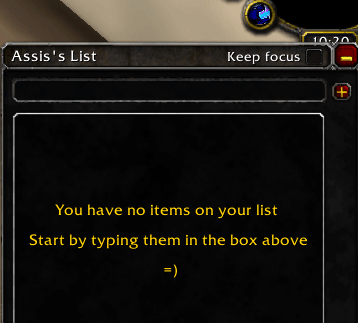
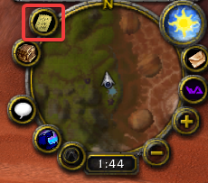

[](https://www.curseforge.com/wow/addons/todochecklister)
[](https://gitmoji.carloscuesta.me)


## Download links
You can download it from a handful of places:
- [Curseforge/twitch](https://www.curseforge.com/wow/addons/todochecklister/files)
- [Github releases](https://github.com/AssisrMatheus/TodoChecklister/releases)

# TodoChecklister
A todolist/checklist AddOn for World of Warcraft. Save the bad guy's names, the items you're going to farm, the path you're going to take.



- Link items from you bag and display their amount
- List is saved even when you log out
- Drag items around to move them
- Click to edit
- Multi-add items with "Keep focus" option!
- More options like opacity or toggling in "Esc" -> Interface Options -> Addons -> Todochecklister

## How to install it
- Download the latest version from any link in the top of this page
- Extract the files on your WoW Addon folder, usually `C:\Program Files (x86)\World of Warcraft\_classic_\Interface\AddOns`.
- Ensure that the .lua files are not spread inside the AddOns folder, but rather, inside the correct `TodoChecklister` folder.
- Your file structure shoud look like this:
```
WowFolder
  \
   \
 Interface
     \
      \ 
    AddOns
        \
         \
     TodoChecklister
           \
            \
	TodoChecklister.toc/src folder
```

## How to use it
- If you happen to have any AddOn that integrates with `AceAddon` or `LibDBIcon`, a "list" button should appear on your minimap and you can toggle the addon by clicking it  
	
- Or you can also type `/todo tg` on your chatbox to toggle the window

## List of slash commands
- **/todo help** - Display available commands on chat
- **/todo reload** - Reset you window to its default properties(size, position, scale)
- **/todo tg** - Toggle the Todo window
- **/todo add {message}** - Adds `{message}` to your item list  
  Example: `/todo add My item` will add a item named "My item" to your list
- **/todo rmv {position}** - Remove item in `{position}`  
  Example: `/todo rmv 1` removes the first item from the list
- **/todo mv {original_position} {target_position}** - Move item from `{original_position}` to `{target_position}`  
  Example: `/todo mv 1 3` Moves the first item in the list to the 3rd slot
- **/todo chk {position}** - Check or unchecks an item in `{position}`  
  Example: `/todo chk 1` Checks the first intem on your list

## Reference material

- [A Guide and Reference for Creating WoW Addons: WoW Programming](http://garde.sylvanas.free.fr/ressources/Guides/Macros-Addons/Wiley-World.of.Warcraft.Programming.A.Guide.and.Reference.for.Creating.WoW.Addons.pdf)
- [Documentation reference](http://wowprogramming.com/docs.html)
- [Widget API](https://wowwiki.fandom.com/wiki/Widget_API)
- [Widget API-2](https://wow.gamepedia.com/Widget_API)
