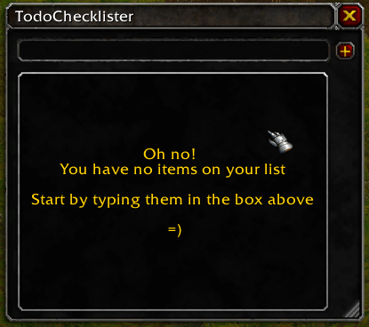

<p align="center">
	<a href="https://gitmoji.carloscuesta.me">
		
	</a>
</p>

## Get on [curseforge](https://www.curseforge.com/wow/addons/todochecklister)

# TodoChecklister
I have bad memory so I made this. A todolist/checklist AddOn for World of Warcraft



**I have tested it only in WoW Classic**

## How to install it
- Download the latest version [here](https://github.com/AssisrMatheus/TodoChecklister/releases/)
- Extract the files on your WoW Addon folder, usually `C:\Program Files (x86)\World of Warcraft\_classic_\Interface\AddOns`.
- Ensure that the .lua files are not spread inside the AddOns folder, but rather, inside the correct `TodoChecklister` folder.
- Your files shoud look like this:
```
WowFolder
  \
   \
 Interface
     \
      \ 
    AddOns
        \
         \
     TodoChecklister
           \
            \
	TodoChecklister.toc/*.lua files/Any other addon file and folder
```

## How to use it
- If you happen to have any AddOn that integrates with `AceAddon` or `LibDBIcon`, a "list" button should appear on your minimap and you can toggle the addon by clicking it  
	
- Or you can also type `/todo tg` on your chatbox to toggle the window

## List of slash commands
- **/todo tg** - Toggle the Todo window
- **/todo help** - Display available commands on chat

## Reference material

- [A Guide and Reference for Creating WoW Addons: WoW Programming](http://garde.sylvanas.free.fr/ressources/Guides/Macros-Addons/Wiley-World.of.Warcraft.Programming.A.Guide.and.Reference.for.Creating.WoW.Addons.pdf)
- [Documentation reference](http://wowprogramming.com/docs.html)
- [Widget API](https://wowwiki.fandom.com/wiki/Widget_API)
